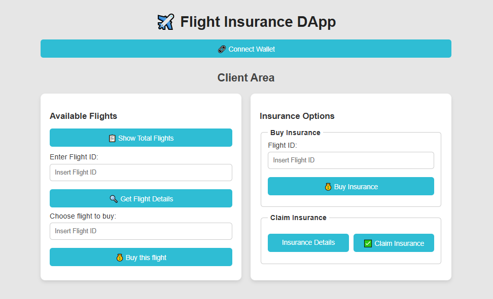

# ✈️ Flight Insurance DApp

A decentralized application (DApp) on Ethereum that lets users buy flight tickets, purchase insurance for a flight, and claim insurance if the flight is delayed.

  
_DApp interface_

---

## 🌟 Features

- 🔗 Connect your wallet (MetaMask) to interact with the DApp.
- 📋 View all available flights and their details.
- 💰 Buy a ticket for a specific flight.
- 🛡️ Purchase insurance for a flight you have a ticket for.
- 👀 Check your insurance status.
- ✅ Claim insurance if the flight is delayed beyond 30 minutes.

---

## 🛠️ Tech Stack

- **Smart Contract:** Solidity (FlightInsurance contract)
- **Frontend:** HTML, CSS, JavaScript
- **Ethereum Library:** ethers.js
- **Wallet Integration:** MetaMask

---

## 🚀 How to Use

1. Click **Connect Wallet** to link your MetaMask account.
2. Click **Show Total Flights** to see all available flights.
3. Enter a flight ID and click **Get Flight Details** to see flight info.
4. Buy a ticket for a flight using the **Buy this flight** button.
5. Purchase insurance using the **Buy Insurance** section.
6. Check your insurance status or claim it after the flight delay period.

> Tip: Outputs like flight details or insurance status disappear automatically after 3 seconds.

---

## ⚠️ Notes

- Only one ticket per flight is allowed per user.
- Each user can buy only one insurance per flight.
- Insurance payouts can only be claimed after 30 minutes past the flight’s scheduled start time.

---

## 📄 License

This project is licensed under the MIT License.
